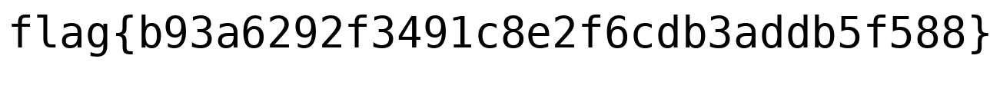

# Blobber

```
This file is really... weird...
```
## Writeup

`file blobber` says that is a sqlite3 flie:
```
sqlite3tmp.out: PNG image data, 1301 x 128, 8-bit/color RGB, non-interlaced
```

Open it with sqlite3, and get table information using `.schema`:

Only  id 238's data is not NULL.
```
select id,length(data) from blobber where data != "";
238|14614
```
Dump it to hex `select id,hex(data) from blobber where data != "";` and save to file using python:
```
a='xxx'
f=open('tmp','wb')
f.write(bytes.fromhex(a))
f.close()
```
the file is a bzip2. uncompress and find out it is a png image:

